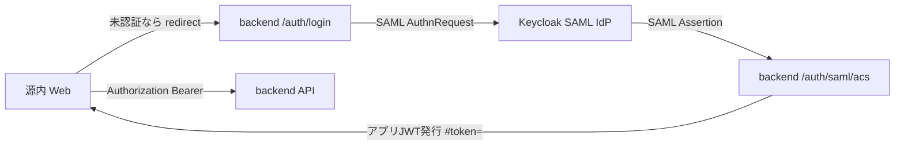

# Open GENAI


デジタル庁がオープンソースで公開したガバメント AI「源内（GENAI）」を、
**完全ローカル環境 × ローカル LLM（OpenAI 互換 API）** で動かすためのプロジェクトです。

> **免責 / Disclaimer**: 本リポジトリは有志による**非公式フォーク**です。デジタル庁とは一切関係がなく、
> 同庁による承認・支援を受けたものではありません。`genai-web/` はデジタル庁の
> [digital-go-jp/genai-web](https://github.com/digital-go-jp/genai-web)（MIT ライセンス）を
> ローカル動作向けに改変して同梱しています（原 LICENSE は `genai-web/LICENSE` に保持）。
> デジタル庁オリジナルの `genai-ai-api` は本リポジトリには含めていません（必要な場合は
> [digital-go-jp/genai-ai-api](https://github.com/digital-go-jp/genai-ai-api) を別途取得してください）。

ホスト OS / ハードウェアは特定環境に依存しません。macOS (Apple Silicon) でも、
Linux + NVIDIA GPU 機（例: **NVIDIA DGX Spark**）でも動作します。

源内はもともと AWS / Azure / Google Cloud などのクラウド前提
（Amazon Cognito 認証・Lambda・Bedrock 等）で作られているため、そのままでは
ローカルで動きません。本プロジェクトは以下を行うことでローカル完結させます。

- 認証（SAML）を **ローカル完結**（`backend` を SAML SP、`Keycloak` を SAML IdP として実装）
- LLM 呼び出しを **OpenAI 互換 API** 経由で行う（既定は Ollama の `/v1`。vLLM / LM Studio / OpenAI など任意の OpenAI 互換サーバに切替可）
- クラウド API（チャット履歴・推論ストリーム）を **ローカルバックエンド（FastAPI）** で代替

```
[ブラウザ] ──▶ proxy (nginx :80) ──▶ web (源内 Web / Vite)
                  │                    REST + ストリーミング
                  ├──▶ backend (FastAPI) ──▶ OpenAI 互換 LLM（Ollama 等）
                  └──▶ keycloak (/kc)      SAML IdP
```

本番は `docker-compose.prod.yml` で TLS(443) 終端。閉域検証は HTTP(80) のみ（`docker-compose.verify.yml`）。

## 構成

| ディレクトリ | 内容 |
| --- | --- |
| `genai-web/` | デジタル庁 源内 Web（フォーク + ローカル化パッチ。同梱） |
| `backend/` | ローカル LLM 用の代替バックエンド（FastAPI / Team API も兼ねる） |
| `rag-app/` | RAG を「行政実務用 AI アプリ」として提供するマイクロサービス（FastAPI） |
| `whisper-app/` | 文字起こしを「AI アプリ」として提供（faster-whisper / CPU） |
| `sd-app/` | 画像生成を「AI アプリ」として提供（ホストの SD サーバへプロキシ） |
| `dify-app/` | 外部 Dify（ワークフロー / チャットフロー）を「AI アプリ」として連携する汎用プロキシ（FastAPI） |
| `shared/` | backend と rag-app で共用するドキュメント抽出モジュール（`docextract.py`） |
| `docker-compose.yml` | proxy + web / backend / … をまとめて起動（HTTP :80 のみ公開） |
| `docker-compose.prod.yml` | 本番 TLS 構成（proxy :80/:443 のみ公開） |
| `docker-compose.verify.yml` | 本番スタックの HTTP 検証用オーバーライド（自己署名不要） |
| `proxy/` | nginx リバースプロキシ設定（`nginx.http.conf` / `nginx.conf`） |

## オリジナル源内からの改修内容（クラウド依存 → オープンアーキテクチャ）

このプロジェクトの中心的な改修は、**源内が依存するクラウドのマネージドサービスを、すべてオープンソース/ローカルの仕組みに置き換える**ことです。置換の全体像は次のとおりです。

| 機能 | 源内オリジナル（クラウド・マネージド） | Open GENAI（オープン/ローカル置換） |
| --- | --- | --- |
| 認証 | Amazon Cognito（SAML は Cognito がブローカー） | **Keycloak**（SAML IdP）＋ `backend`（SAML SP, `python3-saml`）＋ アプリ JWT |
| API 認可 | API Gateway Authorizer / IAM | `backend` の **JWT 検証ミドルウェア** |
| LLM 推論 | Amazon Bedrock | **OpenAI 互換 API**（既定は Ollama の `/v1`。任意の互換サーバに切替可） |
| 推論ストリーム | Lambda `InvokeWithResponseStream`（Cognito Identity Pool 資格情報で直接呼び出し） | `backend` の **HTTP ストリーミング** `/predict/stream` |
| チャット履歴 | Amazon DynamoDB | **SQLite**（`backend`） |
| 保存プロンプト（systemcontexts） | Amazon DynamoDB | **SQLite**（`backend`） |
| チーム / メンバー / AI アプリ管理 | DynamoDB ＋ Cognito グループ | **SQLite** ＋ Keycloak グループ ＋ `team_users.isAdmin` |
| ファイル添付ストレージ | Amazon S3（署名付き URL） | `backend` の **ローカルファイル保存/配信** |
| RAG（ベクトル検索・埋め込み） | OpenSearch / Bedrock Knowledge Base | **Qdrant** ＋ Ollama `mxbai-embed-large`（`rag-app` として） |
| 文字起こし | Amazon Transcribe ＋ S3 | **faster-whisper**（`whisper-app` を AI アプリとして） |
| 画像生成 | Amazon Bedrock（画像モデル） | **Stable Diffusion**（A1111 互換、`sd-app` 経由でプロキシ） |
| ドキュメント読取（PDF 等） | Bedrock の document 入力 | **テキスト抽出**（pypdf / python-docx / openpyxl, `shared/docextract.py`） |

### 追加したコンポーネント（すべてオープンソース）

- `backend/`（FastAPI）: 源内 Web が叩くクラウド API（genU API / Team API / 推論ストリーム）を代替。SAML SP・JWT 発行/検証・ファイル保存も担当
- `rag-app/`（FastAPI）: RAG を源内の作法どおり「行政実務用 AI アプリ（exApp）」として提供
- `keycloak`（SAML IdP・ユーザー管理）/ `qdrant`（ベクトル DB）を `docker-compose.yml` に追加

### 源内 Web（`genai-web/`）への変更点（最小限）

クラウド SDK 呼び出し箇所のみをローカル向けに差し替えています。

- 追加: `packages/web/src/local/localAuth.ts` — ローカル SAML 認証のフロント側（JWT 取得/ログイン/サインアウト）
- 追加: `packages/web/.env` — ローカル向け `VITE_APP_*`（接続先・モデル一覧 等）
- 改修: `src/main.tsx` — Cognito/SAML ログインゲート → **ローカル SAML ログインゲート**（AWS Amplify 撤去）
- 改修: `src/hooks/useAuth.ts` — `fetchAuthSession()` → ローカル JWT デコード
- 改修: `src/lib/fetcher.ts` — Cognito トークン → **ローカル JWT を Bearer 送信**
- 改修: `src/lib/chatApi.ts` — `predictStream` を **Lambda 直接呼び出し → `/predict/stream` の fetch**
- 改修: `src/lib/fileApi.ts` — S3 URL 前提 → ローカル http URL に対応
- 改修: `src/components/ui/Header.tsx` — Amplify `useAuthenticator` → `localAuth.signOut`
- 改修: `src/features/chat/hooks/useFileUploadable.ts` — 添付可否を選択中モデルに連動
- 改修: `src/pages/SignedOutPage.tsx` — 再ログイン導線を追加
- 改修: `packages/common/src/application/model.ts` — ローカル（Ollama）モデルの定義 + `doc`（ドキュメント添付）フラグを有効化
- 改修: `packages/web/vite.config.ts` — コンテナ実行向けに `host`/ポーリング監視を設定
- 改修: `src/features/exapps/hooks/useGenUApps.ts` — クラウド依存の組み込み「文字起こし」をメニューから除外（ローカル Whisper の AI アプリで代替）
- 改修: `src/features/team-apps/utils/endpointUrl.ts` — AI アプリのエンドポイント URL 検証を `http` も許可（ローカルのコンテナ間通信 `http://dify-app:8004/invoke` 等のため。従来は `https` 必須）
- 改修: `src/features/teams/components/DialogDeleteTeam.tsx` — チーム削除時に知識ベースも消える旨の警告を追加
- 改修: 翻訳/ダイアグラム画面の説明文をローカル実態（Ollama）に合わせて修正
- 削除: `src/components/auth/AuthWithUserpool.tsx` / `AuthWithSAML.tsx`（Cognito 専用のため不要）
- 依存削除: `aws-amplify` / `@aws-amplify/ui-react` / `@aws-sdk/client-lambda` / `@aws-sdk/client-transcribe` / `@aws-sdk/credential-providers`（`packages/web/package.json`）＋ `index.css` の Amplify CSS import
- 表記修正: 翻訳画面の「AWS の Bedrock を利用」→「ローカルの LLM(Ollama) を利用」

> 注: 源内の CDK / IaC（`packages/cdk` 等）は AWS デプロイ専用のため、本プロジェクトでは使用しません（参照のみ）。

## 前提

- Docker / Docker Compose
- OpenAI 互換 API を提供できる LLM 実行環境（既定は [Ollama](https://ollama.com/)）

## 対応ホスト / GPU

LLM・画像生成（SD）は計算資源が必要です。ホスト環境ごとの推奨構成は次のとおりです。
いずれの場合も、源内 Web / backend / 各 AI アプリのコンテナ自体はどの環境でも同じように動きます。

| ホスト | LLM(Ollama) の実行 | 画像生成(SD) の実行 | 備考 |
| --- | --- | --- | --- |
| **macOS (Apple Silicon)** | **ホスト**で実行（Metal GPU で高速） | **ホスト**で実行（A1111 等） | Docker は GPU(Metal) を使えないため、GPU を使う処理はホスト側で動かし、コンテナはそれにプロキシ |
| **Linux + NVIDIA GPU（例: NVIDIA DGX Spark）** | ホスト or **コンテナ**で実行（CUDA GPU） | ホスト or **コンテナ**で実行（CUDA GPU） | [NVIDIA Container Toolkit](https://docs.nvidia.com/datacenter/cloud-native/container-toolkit/latest/install-guide.html) を入れればコンテナでも GPU 利用可 |
| その他 / CPU のみ | ホスト or コンテナ（低速） | CPU は非現実的 | 任意の OpenAI 互換サーバ（vLLM / LM Studio / OpenAI 等）に向けることも可能 |

- LLM の接続先は OpenAI 互換 API です。既定は `OLLAMA_BASE_URL`(+`/v1`)、`OPENAI_BASE_URL` で任意のサーバに切替できます（後述）。
- `host.docker.internal` は Docker Desktop（macOS/Windows）に加え、Linux でも `extra_hosts: host-gateway` で解決するよう設定済みです。
- Linux + NVIDIA でコンテナに GPU を割り当てる場合は、対象サービス（例 `ollama`）に `gpus: all`（または `deploy.resources.reservations.devices`）を追加してください（macOS 既定構成では不要なため同梱していません）。

## 使い方

### 1. Ollama を起動してモデルを取得

```bash
# ホストで Ollama を起動（インストール済みの場合）
ollama serve            # 別ターミナルで起動したままにする

# モデルを取得（日本語に強い Qwen2.5 を推奨）
ollama pull qwen2.5:7b
# 軽量に試すなら: ollama pull qwen2.5:3b  /  ollama pull qwen2.5:0.5b
```

> Ollama をコンテナで動かしたい場合は `docker compose --profile ollama up` を使い、
> `.env` の `OLLAMA_BASE_URL` を `http://ollama:11434` に変更してください。
> Linux + NVIDIA GPU（DGX Spark 等）では、`ollama` サービスに GPU を割り当てると
> コンテナのまま高速に動かせます（`NVIDIA Container Toolkit` 導入のうえ `gpus: all` を付与）。
> macOS では Docker から GPU を使えないため、Ollama は**ホスト**で動かすのが推奨です。

### 2. 設定

```bash
cp .env.example .env    # 必要に応じて DEFAULT_MODEL などを編集
```

利用したいモデルを増やす場合は `genai-web/packages/web/.env` の
`VITE_APP_MODEL_IDS`（Ollama のモデル名と一致させる）を編集してください。
モデルの表示名は `genai-web/packages/common/src/application/model.ts` に定義しています。

#### LLM バックエンドの差し替え（OpenAI 互換）

LLM（チャット/RAG 生成/埋め込み）はすべて **OpenAI 互換 API** 経由で呼び出します。
既定では Ollama の `/v1`（`OLLAMA_BASE_URL` + `/v1`）を使います。
Ollama 以外（vLLM / LM Studio / OpenAI 等）に向けたい場合は `.env` で設定します。

```bash
# 例: 別の OpenAI 互換サーバに向ける
OPENAI_BASE_URL=http://host.docker.internal:8001/v1
OPENAI_API_KEY=sk-...   # サーバが要求する場合のみ
```

### 3. 起動

```bash
docker compose up --build
```

- 源内 Web: http://localhost/ （`.env` の `PROXY_HTTP_PORT` / `PUBLIC_URL` で変更可）
- バックエンド API: http://localhost/api/health
- Keycloak 管理: http://localhost/kc/

初回はフロントエンドの依存インストールに数分かかります。

> ポート 80 が使用中の場合は `.env` で `PROXY_HTTP_PORT=8080` と
> `PUBLIC_URL=http://localhost:8080` に設定してください。

## 動作確認

- http://localhost/api/health で `status: ok` と取得済みモデル一覧が返ること
- http://localhost/ を開くと Keycloak のログイン画面に遷移し、`admin` / `password` でログインできること
- 「チャット」からメッセージを送り、ローカル LLM の応答がストリーミング表示されること
- 「AIアプリ」→「ローカル RAG」で質問でき、出典付きで回答されること（起動済みアプリのみ一覧に表示）
- 「翻訳」「ダイアグラムを生成」「文章を生成」がローカル LLM で動作すること

## ファイル添付（画像 / ドキュメント）

チャットでは画像とドキュメントを添付できます（モデルの対応機能フラグに応じて添付ボタンが出ます）。

### 画像（マルチモーダルモデル）

- モデル選択で **「Gemma 3 27B (ローカル・画像対応)」** を選ぶと画像添付が使えます
- 対応形式: `.jpg / .jpeg / .png / .webp`
- 画像は推論時に OpenAI 互換の **Vision 形式**（`image_url` data URL）で LLM に渡されます
- 他の画像対応モデル（例 `llava`, `llama3.2-vision` 等）も、`ollama pull` のうえ
  `genai-web/packages/web/.env` と `packages/common/src/application/model.ts` に画像フラグ付きで追加すれば利用できます

### ドキュメント（PDF / Word / Excel / テキスト）

- すべてのローカルモデルで **ドキュメント添付**が使えます（`doc` フラグを有効化済み）
- 対応形式: `.pdf / .docx / .xlsx / .txt / .md / .csv / .html / .json` など
- ローカル LLM はドキュメントを直接読めないため、**backend がテキストを抽出してプロンプトに注入**します（PDF=pypdf、Word=python-docx、Excel=openpyxl、テキスト=そのまま）
- 抽出テキストは長すぎる場合 `MAX_DOC_CHARS`（既定 30000 文字）で打ち切ります
- レガシー形式（`.doc` / `.xls` のバイナリ旧形式）はテキスト抽出に未対応です

> アップロードしたファイルは backend（`backend_data` ボリューム）に保存されます。

## 認証（SAML）

源内の SAML 認証を、ローカル完結する形で実装しています。



- `backend` が SAML SP（`python3-saml`）として動作し、検証後にアプリ JWT を発行
- `Keycloak`（`http://localhost/kc/`）が SAML IdP兼ユーザー管理
- 各 API は JWT(Bearer) で保護（未認証は 401）

初期ユーザー（realm `open-genai`、いずれもパスワードは `password`）:

| ユーザー名 | 役割 | 備考 |
| --- | --- | --- |
| `admin` | 管理者 | `SystemAdminGroup` 所属。ヘッダーに管理メニュー表示 |
| `user` | 一般 | |

- ユーザー追加・管理は Keycloak 管理コンソール（`http://localhost/kc/`、管理者は `.env` の `KEYCLOAK_ADMIN`/`KEYCLOAK_ADMIN_PASSWORD`）→ realm `open-genai` から行えます。
- 管理者にしたいユーザーは `SystemAdminGroup` グループに追加してください（SAML 属性 `groups` 経由でアプリに連携されます）。
- 初回は Keycloak の起動に数十秒かかります。起動直後にログインへ進めない場合は少し待って再試行してください。

## RAG（AI アプリ）

源内の作法どおり、RAG を **外部マイクロサービス「行政実務用 AI アプリ」** として実装しています
（`ブラウザ → backend(Team API) → rag-app → Qdrant / Ollama`）。

使い方:
1. ヘッダーの **「AI アプリ」** を開く → **「ローカル RAG（ナレッジ検索）」** を選択
2. 質問を入力して「実行」。知識ベースを検索し、**出典付き**で回答します
3. 「参照ドキュメント」に **PDF / Word(.docx) / Excel(.xlsx) / テキスト(.txt/.md/.csv 等)** を添付すると回答に利用します（テキスト抽出は `shared/docextract.py` を backend と共用）

### 知識ベースのスコープ（チーム単位で分離）

ナレッジは **チーム（＝ RAG アプリを所有するチーム／ユーザグループ）単位で分離**されます。

- **共通チームのRAG**: 全認証済みユーザーが使う**共有**ナレッジ。
- **チーム作成時に「ローカル RAG（チーム名）」が自動登録**され、そのチーム専用の**閉じた**ナレッジになります（他チームからは参照不可）。
- 取り込み／検索／出典一覧／削除／全消去はすべて、そのアプリが属するチームのスコープ内に限定されます（backend が `x-scope = teamId` を AI アプリへ連携、Qdrant の `scope` で分離）。

### 知識ベースの管理（AIアプリのフォームから）

ローカル RAG アプリのフォームで、検索だけでなく知識ベースの管理ができます。

- **添付ファイルの扱い**: 「知識ベースに登録（永続）」/「この質問だけで使う（一時）」を選べます。一時はその回答だけで使い、Qdrant に保存しません。
- **操作**:
  - 「登録済みの出典を一覧」: 取り込み済みファイルとチャンク数を表示
  - 「指定した出典を削除（管理者）」: `削除する出典名` に出典（ファイル名）を入れて実行
  - 「知識ベースを全消去（管理者）」: 全データを削除
- **重複排除**: 同一内容のチャンクは（出典＋本文のハッシュで）重複登録されません。同じファイルを再投入してもチャンクは増えません。
- 管理者操作は `SystemAdminGroup` のユーザーのみ実行できます（backend が `x-user-groups` を AI アプリへ連携）。

知識ベースへの一括登録（CLI 例。`scope` を省略すると共通チームへ登録）:

```bash
docker compose exec rag-app sh -lc 'curl -s -X POST http://localhost:8001/ingest \
  -H "x-api-key: local-rag-key" -H "Content-Type: application/json" \
  -d "{\"scope\":\"00000000-0000-0000-0000-000000000000\",\"documents\":[{\"text\":\"登録したい本文\",\"source\":\"出典名\"}]}"'
```

- 埋め込み: Ollama `mxbai-embed-large`（`ollama pull mxbai-embed-large` が必要）
- ベクトル DB: Qdrant（`qdrant_data` ボリュームに永続化）
- 回答生成モデル: `.env` の `RAG_MODEL`（既定 `gpt-oss:20b`）

## 文字起こし / 画像生成（AI アプリ）

文字起こしと画像生成も、RAG と同じく **外部マイクロサービスの「AI アプリ」** として実装しています（共通チームに登録済み）。

### 文字起こし（ローカル Whisper）

- `whisper-app`（faster-whisper / CPU）。音声を添付して実行すると文字起こし（タイムスタンプ付き）を返します。
- モデルは `.env` の `WHISPER_MODEL`（既定 `medium`。`small`/`large-v3` も可）。初回実行時にモデルを取得し `whisper_cache` ボリュームにキャッシュします。
- クラウドの Amazon Transcribe + S3 への依存を置き換えています。

### 画像生成（Stable Diffusion）

- `sd-app` は **AUTOMATIC1111 互換 SD サーバ**（`/sdapi/v1/txt2img`）にプロキシします。SD 本体の置き場所はホスト環境で選べます。
  - **macOS**: Docker は GPU(Metal) を使えないため、SD 本体は**ホスト**で動かします。[AUTOMATIC1111 stable-diffusion-webui](https://github.com/AUTOMATIC1111/stable-diffusion-webui) 等を `--api` 付きで `:7860` に起動してください。
  - **Linux + NVIDIA GPU（DGX Spark 等）**: SD を**コンテナでも GPU 実行**できます（A1111/ComfyUI 等のコンテナ）。その場合は `SD_API_URL` をそのコンテナのアドレスに設定してください。
- 接続先は `.env` の `SD_API_URL`（既定: ホストの `http://host.docker.internal:7860`）で変更できます。
- SD サーバが起動していない場合、後述のヘルスチェックにより一覧から自動的に隠れます。

### AI アプリの表示（ヘルスチェック）

AI アプリ一覧（`/exapps`）は各アプリの `/health` を確認し、**起動していない（到達できない）アプリは自動的に一覧から隠します**。例えばホストの SD サーバが未起動なら「画像生成」は表示されません。起動すると表示されます。

## Dify 連携（AI アプリ）

外部の [Dify](https://dify.ai/) で作成した **ワークフロー / チャットフロー** を、源内の「AI アプリ」として呼び出せます。`dify-app` という汎用プロキシを 1 つ立て、**Dify のフローごとに「AI アプリ」を登録**する方式です（フロー単位に接続先・APIキー・種別を設定）。

```
[ブラウザ] → backend(Team API) → dify-app → 外部 Dify(/v1)
```

- `dify-app` は源内の AI アプリ・プロトコル（同期 `{inputs}` → `{outputs}`）を、Dify の API（`/v1/workflows/run` または `/v1/chat-messages`）に変換します。
- **UI は種別で出し分きます**。`dify_app_type` が `workflow` のアプリは従来の**フォーム実行型 UI**、`chat` のアプリは**対話型 UI**（吹き出し形式のチャット画面）で開きます。どちらも「AI アプリ」一覧に並びます。
- Dify の **blocking モードには既知の不具合**（1.4.1〜1.13 系で blocking 指定でも `text/event-stream` を返す）があるため、`dify-app` は常に **streaming で受信してサーバ側で集約**し、源内には同期 `outputs` として返します。
- Dify 本体は本リポジトリには含めません（**既存/外部の Dify** に接続します）。`host.docker.internal` 経由でホスト上の Dify にも接続できます。
- ワークフロー用アプリとチャットフロー用アプリはエンドポイントが同じ（`dify-app`）でも問題ありません。**APIキー**（ワークフロー用 / チャット用）と `dify_app_type` で区別します。

### 登録手順（チーム管理 → アプリの作成）

ヘッダー右上「アカウント」→「チーム管理」→ 対象チーム →「アプリの作成」で、以下を入力します。**フォームの項目名と入れる内容の対応に注意してください**（接続情報は「コンフィグ」、フォーム定義は「APIリクエストのデータ形式」です）。

| フォーム項目 | 入れる内容 |
| --- | --- |
| APIエンドポイントのURL | `http://dify-app:8004/invoke` |
| APIキー | Dify アプリの API キー（Dify の「APIアクセス」で発行） |
| APIリクエストのデータ形式(JSON) | フロー入力に合わせた**フォーム定義 JSON**（後述） |
| コンフィグ（JSON） | **Dify 接続情報 JSON**（接続先・種別など。後述） |

#### コンフィグ（JSON）の例（= AI アプリの config）

```jsonc
// ワークフロー
{
  "dify_base_url": "http://host.docker.internal/v1",
  "dify_app_type": "workflow",
  "response_field": "result"   // 任意。workflow の outputs から取り出すキー
}
```

```jsonc
// チャットフロー
{
  "dify_base_url": "http://host.docker.internal/v1",
  "dify_app_type": "chat",
  "query_field": "query"       // 任意。chat の query に使う入力キー（既定: query）
}
```

- `dify_base_url`: Dify の API ベース URL（末尾 `/v1`）。**必須**（未設定時は `.env` の `DIFY_BASE_URL` を使用）。
- `dify_app_type`: `workflow` または `chat`（既定 `chat`）。
- `query_field`（chat）: ユーザー入力をどの入力キーから取るか（既定 `query`、後方互換で `question` も可）。
- `response_field`（workflow）: Dify の `outputs`（dict）から表示に使うキー。未指定なら単一キーはその値、複数キーは全体を整形。
- `file_var`（任意, chat / workflow 共通）: 添付ファイルを渡す Dify の入力変数名。通常は `/v1/parameters` から**自動検出**するため指定不要。自動検出を上書きしたいときのみ指定します。

> 「コンフィグ（JSON）」の既定値 `{"max_payload_size":"6MB"}` は、上記の Dify 接続情報に置き換えて構いません（必要なら `max_payload_size` も併記できます）。

#### APIリクエストのデータ形式(JSON) の例（= AI アプリの placeholder / 入力フォーム）

入力フォームは [AI アプリ API 仕様](genai-web/docs/AIアプリAPI仕様.md) に従って定義します。**フォームの各キーが Dify の入力変数名に対応**します。

ワークフロー（フォーム型）の例:

```json
{
  "query": {
    "title": "入力",
    "type": "textarea",
    "required": true
  }
}
```

> フォーム型（ワークフロー）は、このデータ形式を**空のまま**にすると、アプリを開いたときに `dify-app` が Dify の `/v1/parameters` から入力フォームを**自動生成**します（手書き不要）。Dify のコンポーネント（`text-input`/`paragraph`/`number`/`select`/`file`/`file-list`）を源内のフォーム項目に変換します。手書きで定義した場合はそちらが優先されます。

チャットフロー（`dify_app_type: "chat"`）は**対話型 UI で開くため、このフォーム定義は画面には使われません**。空のままで構いません。

```json
{
  "query": { "title": "メッセージ", "type": "textarea", "required": true }
}
```

### チャットフロー = 対話型 UI（対話できる）

`dify_app_type` を `chat` にしたアプリは、源内が **対話型 UI**（吹き出し形式のチャット画面）で開きます。フォーム実行型ではなく、メッセージを送るたびに会話が継続します。

- 会話の文脈は、源内が会話ごとに発行する `sessionId` を `dify-app` が **Dify の `conversation_id` に対応付けて保持**することで維持されます（SQLite, `dify_app_data` ボリューム）。
- 画面の **「新しい会話」** ボタンで `sessionId` をリセットし、新しい Dify 会話を開始できます。
- 画像 / ドキュメントの添付に対応します（`dify-app` が `/v1/files/upload` 経由で Dify に渡します）。
- チャットフロー用アプリには **チャットフローの API キー** を登録してください（ワークフローとはキーで区別）。

> 補足: フォーム型アプリ（ワークフロー等）でも、placeholder に `conversation_history` キーを含めると実行結果に「会話を続ける」ボタンが出ます（疑似チャット）。チャットフローは上記の対話型 UI を使うため、この指定は不要です。
>
> AI アプリの実行履歴は backend(SQLite, `backend_data` ボリュームの `open-genai-teams.db`) に保存されます。

### ファイル添付

添付ファイルは Dify の `/v1/files/upload` にアップロードし、`upload_file_id` 参照として渡します。ファイル種別（image / audio / video / document）は MIME から自動判定します。

ファイル入力変数の解決は **チャットフロー / ワークフロー共通** で、次の順に行います（**変数名は源内側で固定しません**。フロー作成により変わってよい）。

1. `config` の `"file_var": "<変数名>"`（画面から明示指定・任意の上書き）
2. Dify の `/v1/parameters` から `file` / `file-list` 型の入力変数（例: `upload_files`）を**自動検出**
3. 上記で解決できない場合のフォールバック
   - チャットフロー: メッセージ添付（`sys.files`）として送信
   - ワークフロー: 源内フォームのキー名を Dify 変数名として割り当て

- 変数の型（`file` / `file-list`）も `/v1/parameters` から判定し、単一/配列で渡します。
- Dify 側でフローが「メッセージ添付」ではなく「入力変数(file-list)」でファイルを受け取る設計（`file_upload.enabled: false` でも入力変数は利用可）にも対応します。

### 制約

- 呼び出しは**同期形式**です（Dify 側は streaming で受信して集約）。非同期ポーリング形式は未対応です。
- 会話継続は**チャットフロー**が対象です（ワークフローは状態を持ちません）。

## チーム / AI アプリ管理

源内の「チーム管理」機能をローカル(SQLite)で実装しています。クラウドの DynamoDB / Cognito グループに依存せず、`backend` 内で完結します。

- チーム・メンバー・AI アプリの作成/編集/削除（ヘッダー右上「アカウント」→「チーム管理」）
- 権限モデル:
  - `SystemAdminGroup`（Keycloak グループ）: 全チームを管理。チーム作成/削除が可能
  - チーム管理者（`team_users.isAdmin`）: 自チームのメンバー/アプリを管理。**ログイン時に自動で `TeamAdminGroup` が付与**され、Keycloak 側でのグループ手動設定は不要
  - 一般メンバー: 所属チーム + 共通チームのアプリを閲覧・実行
- 共通チーム（`00000000-0000-0000-0000-000000000000`）のアプリは全認証済みユーザーが利用可能。既定の「ローカル RAG」はここに登録されています
- **チーム作成時**: そのチーム専用の「ローカル RAG（チーム名）」を自動登録します（ナレッジはチームに閉じる）
- **チーム削除時**: メンバー・AI アプリ設定に加え、**そのチームの知識ベース（Qdrant）も自動消去**します。削除確認ダイアログに警告を表示します
- AI アプリは「リクエスト形式」(JSON) でフォームUIを定義し、外部マイクロサービスの REST API（同期: `{inputs}` → `{outputs}`）を呼び出します（[AI アプリ API 仕様](genai-web/docs/AIアプリAPI仕様.md) 準拠）

データは `backend_data` ボリュームの `open-genai-teams.db` に保存されます。

## 制限事項（ローカル版）

- 画像生成（コア機能のページ）はクラウド(Bedrock)依存のため無効化のまま。画像生成は上記の「AI アプリ」(`sd-app`) で代替（別途 SD サーバが必要。macOS はホスト、Linux+NVIDIA はコンテナ/ホストいずれも可）
- AI アプリの呼び出しは同期形式のみ対応（非同期のポーリング形式は未対応）
- 添付のうち **動画** はローカル LLM が直接扱えないため未対応（画像・ドキュメントは対応）
- 認証は SAML（Keycloak）で行いますが、開発用の簡易設定（HTTP・既定パスワード・自己署名相当）です。
  **クローズドなローカル環境での利用**を前提とし、外部公開する場合は鍵・パスワード・TLS を見直してください

## ライセンス

- 本プロジェクト独自のコード（`backend/`, `rag-app/`, `whisper-app/`, `sd-app/`, `shared/`,
  `docker-compose.yml` 等）は **MIT License**（ルート `LICENSE`）。
- 同梱の `genai-web/` はデジタル庁による公開物（**MIT** / ドキュメントは **CC BY 4.0**）を改変したもので、
  原ライセンス・著作権表示は `genai-web/LICENSE`・`genai-web/THIRD-PARTY-NOTICES.txt` に保持しています。
- 本リポジトリはデジタル庁とは無関係の非公式フォークです（上部の免責を参照）。
